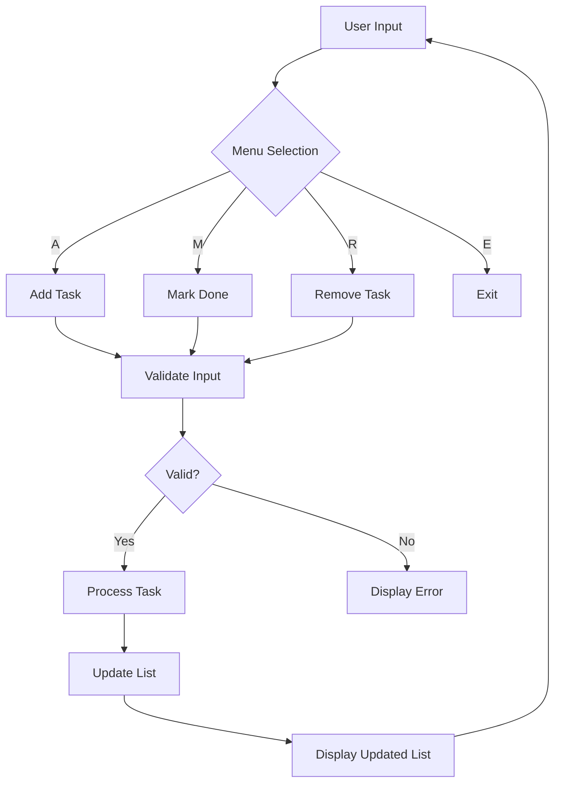

# TODO App - Command-Line Task Management System

A Python-based command-line application for managing daily tasks and to-do lists. Built with clean, maintainable code following Python best practices, this application provides a simple yet powerful interface for task management.

## Table of Contents

- [Overview](#overview)
- [Key Features](#key-features)
- [System Requirements](#system-requirements)
- [Project Structure](#project-structure)
- [Installation](#installation)
- [Usage](#usage)
- [Command Reference](#command-reference)
- [Application Flow](#application-flow)
- [Data Model](#data-model)
- [Error Handling](#error-handling)
- [Testing](#testing)
- [Code Quality](#code-quality)
- [Contributing](#contributing)
- [License](#license)
- [Author](#author)

## Overview

The TODO App is a single-file, dependency-free command-line application designed for personal task management. It implements a minimal viable product (MVP) approach with core functionality including task creation, task completion tracking, and task removal. The application is built using Python 3.10+ and leverages the standard library exclusively.

### Design Philosophy

- **Simplicity**: Minimal codebase for easy understanding and modification
- **Reliability**: Comprehensive input validation and error handling
- **Maintainability**: Clear separation of concerns with distinct modules
- **Extensibility**: Modular architecture supporting future feature additions

## Key Features

| Feature | Description | Status |
|---------|-------------|--------|
| Task Creation | Add unlimited tasks with descriptive names | ✅ Active |
| Task Completion | Mark tasks as complete with visual indicators | ✅ Active |
| Task Removal | Delete completed or unwanted tasks | ✅ Active |
| Persistent Display | Real-time list updates with numbered indices | ✅ Active |
| Input Validation | Comprehensive validation for all user inputs | ✅ Active |
| Graceful Exit | Clean program termination with user notification | ✅ Active |
| Case-Insensitive Menu | Accepts both uppercase and lowercase menu options | ✅ Active |
| Empty State Handling | Clear feedback when the list is empty | ✅ Active |

## System Requirements

### Hardware

- Any modern computer with Python execution capability
- Minimum 50 MB free disk space
- Minimum 512 MB RAM (recommended)

### Software

- **Python**: Version 3.10 or higher
- **Operating System**: Windows 10+, macOS 10.15+, Linux (any distribution)
- **Terminal/Command Prompt**: Standard command-line interface
- **Text Editor**: Any editor for viewing source code (optional)

### Dependencies

This application requires **zero external dependencies**. It uses only Python standard library modules:

| Module | Purpose |
|--------|---------|
| `abc` | Abstract base class for type definitions |
| `os` | Operating system interface for terminal clearing |
| `sys` | System-specific parameters and functions |

## Project Structure

```
TODO App/
├── ReadMe.md                    # Project documentation (this file)
├── main.py                      # Application entry point
├── todo_app.py                  # Main application controller
├── todo_tasks.py                # Business logic and task handler
├── data_classes.py              # Data model definitions
├── test_debug.py                # Debug/testing script
├── llm workflow/                # LLM workflow artifacts
│   ├── ReadMe.md                # Workflow overview
│   ├── tools/                   # Utility modules
│   │   ├── date.py              # Date/time utilities
│   │   └── ReadMe.md           # Tools documentation
│   ├── unit tests/              # Automated test suite
│   │   ├── test_todo_app.py    # Core functionality tests
│   │   ├── test_main_menu.py   # Menu and edge case tests
│   │   └── ReadMe.md          # Testing documentation
│   └── documentation/           # Generated documentation
│       ├── document_output.txt # Program behavior analysis
│       ├── document_code_review.txt # Code quality review
│       └── ReadMe.md         # Documentation overview
└── __pycache__/                 # Python bytecode cache (auto-generated)
```

## Installation

### Prerequisites

Ensure Python 3.10+ is installed on your system. Verify installation:

```bash
python --version
# Expected output: Python 3.10.x or higher
```

### Step-by-Step Installation

1. **Clone or Download**: Obtain the project files
   ```bash
   # From git repository
   git clone <repository_url>
   cd "TODO App"
   
   # Or download and extract files to desired location
   ```

2. **Verify Files**: Ensure all required files are present
   ```bash
   ls -la
   # Expected files: ReadMe.md, main.py, todo_app.py, todo_tasks.py, data_classes.py
   ```

3. **No Additional Setup**: The application is ready to run immediately
   - No virtual environment required
   - No package installation needed
   - No configuration files to set up

## Usage

### Launching the Application

```bash
# Navigate to project directory
cd "TODO App"

# Execute the main application
python main.py
```

### Running the Application

Upon execution, the application displays a welcome message and the main menu:

```
Welcome to the TODO List App

1. [A]dd
2. [M]ark done
3. [R]emove
4. [E]xit

Enter option (A,M,R,E): 
```

### Navigation Options

| Key | Action | Description |
|-----|--------|-------------|
| `A` | Add Task | Create a new task with your input |
| `M` | Mark Done | Mark an existing task as complete |
| `R` | Remove | Delete a task from the list |
| `E` | Exit | Terminate the application |

### Interactive Workflows

#### Adding a Task

```bash
Enter option (A,M,R,E): A
Choose what todo item you want to mark as Done:
1. Existing Task Pending
Provide a TODO name: Buy groceries
TODO added to list
```

#### Marking a Task Complete

```bash
Enter option (A,M,R,E): M
Choose what todo item you want to mark as Done:
1. Buy groceries Pending
Provide a TODO list number: 1
Buy groceries marked as done
```

#### Removing a Task

```bash
Enter option (A,M,R,E): R
Choose what todo item you want to remove:
1. Buy groceries Done ✅
2. Existing Task Pending
Provide a TODO list number: 1
TODO removed to list
```

## Command Reference

### Menu Options

#### [A]dd - Create New Task
- **Input**: Task name/description (string)
- **Output**: Confirmation message or error
- **Behavior**: Appends new task to list, displays updated list

#### [M]ark Done - Complete Task
- **Input**: Task number (1-indexed, positive integer)
- **Output**: Completion confirmation or error
- **Behavior**: Marks task as complete, displays "Done ✅" status

#### [R]emove - Delete Task
- **Input**: Task number (1-indexed, positive integer)
- **Output**: Deletion confirmation or error
- **Behavior**: Removes task from list, displays updated list

#### [E]xit - Terminate
- **Input**: None (automatic)
- **Output**: None
- **Behavior**: Closes application gracefully

### Error Messages

| Error | Cause | Resolution |
|-------|-------|------------|
| "invalid option" | Invalid menu key | Enter A, M, R, or E |
| "Input must be provided" | Empty task name | Provide a non-empty string |
| "input must a valid number" | Non-numeric index | Enter a number (e.g., 1, 2, 3) |
| "number must be within list index range" | Invalid range | Enter number between 1 and list length |
| "<list is empty>" | Empty task list | Add a task first |

## Application Flow

### Main Loop Architecture

```
┌─────────────────────────────────────────────────────────────┐
│                     MAIN MENU LOOP                           │
├─────────────────────────────────────────────────────────────┤
│                                                             │
│  ┌───────────┐   ┌───────────┐   ┌─────────────────────┐   │
│  │  Clear    │→ │ Display   │→ │    Display Menu      │   │
│  │   Screen │   │  List     │   │    (A,M,R,E)        │   │
│  └───────────┘   └───────────┘   └─────────────────────┘   │
│         │                │                  │               │
│         ▼                ▼                  ▼               │
│  ┌────────────────────────────────────────────────────────┐ │
│  │                    INPUT PROCESSING                     │
│  │  ┌─────────────┐  ┌─────────────┐  ┌────────────────┐  │ │
│  │  │ User Input  │→ │ Uppercase   │→ │    Match Case  │  │ │
│  │  │  (char)     │  │ Conversion  │  │    (A/M/R/E)   │  │ │
│  │  └─────────────┘  └─────────────┘  └────────────────┘  │ │
│  └────────────────────────────────────────────────────────┘ │
│         │                │                  │               │
│         ▼                ▼                  ▼               │
│  ┌──────────┐  ┌──────────┐  ┌─────────────────────┐       │
│  │ Add Task │  │ Mark Done│  │ Remove Task         │       │
│  │  Handler │  │  Handler │  │  Handler            │       │
│  └──────────┘  └──────────┘  └─────────────────────┘       │
│                                                             │
│  ┌────────────────────────────────────────────────────────┐ │
│  │                     EXIT CONDITION                      │ │
│  │           User presses 'E' or Ctrl+C                    │ │
│  └────────────────────────────────────────────────────────┘ │
│                                                             │
└─────────────────────────────────────────────────────────────┘
```

### Data Flow



## Data Model

### Core Classes

#### `TodoItem` (data_classes.py)

```python
class todo_item(todo):
    - name: str         # Task description
    - _isDone: bool     # Completion status (private)
    
    Methods:
    - markDone()         # Set _isDone to True
    - getStr()          # Return formatted string with status
```

**Output Format Examples:**
- Pending: `"Buy groceries Pending"`
- Complete: `"Buy groceries Done ✅"`

#### `TodoHandler` (todo_tasks.py)

```python
class todo_handler:
    - _todo_list: list[TodoItem]  # Task collection
    
    Methods:
    - add_todo(name: str) -> str
    - remove_todo(value: str) -> str
    - markAsDone(value: str) -> str
    - display_list() -> None
    - display_menu(items) -> None
    - isNotEmpty() -> bool
    - isInRange(index: int) -> bool
```

#### `TODO_app` (todo_app.py)

```python
class TODO_app:
    - _menu_items: tuple[str]    # Menu options
    - _handler: TodoHandler      # Business logic instance
    
    Methods:
    - start() -> None            # Main application loop
    - __add() -> None            # Add task handler
    - __markDone() -> None       # Mark done handler
    - __remove() -> None         # Remove task handler
```

### Data Structures

| Structure | Purpose | Example |
|-----------|---------|---------|
| `list[TodoItem]` | Task storage | `[TodoItem("A"), TodoItem("B")]` |
| `tuple[str]` | Menu options | `("[A]dd", "[M]ark done", ...)` |
| `bool` | Completion flag | `True` (done), `False` (pending) |

## Error Handling

### Validation Layers

The application implements **defensive programming** at multiple levels:

```python
# Layer 1: Input sanitization
user_input = input("Enter option").strip()  # Remove leading/trailing whitespace

# Layer 2: Type conversion with fallback
try:
    index = int(user_input)
except (ValueError, TypeError):
    return "Please enter a valid number"

# Layer 3: Business logic validation
if not self.isInRange(index):
    return f"Please enter a number between 1 and {len(self._todo_list)}"

# Layer 4: Empty state checks
if not self.isNotEmpty():
    print("<list is empty>")
    return
```

### Error Categories

| Category | Examples | Handling |
|----------|----------|----------|
| **User Input** | Invalid menu key, non-numeric index | Informative error messages |
| **Business Logic** | Empty list operations, out-of-range indices | Context-aware feedback |
| **System** | KeyboardInterrupt (Ctrl+C) | Graceful cleanup |
| **Edge Cases** | Whitespace-only input, very large numbers | Validation and truncation |

### Error Response Strategy

The application follows a consistent error response pattern:

1. **Immediate Feedback**: Error message displayed on next screen
2. **No Data Loss**: Invalid input doesn't corrupt the task list
3. **Continued Operation**: Application returns to menu for retry
4. **Clear Guidance**: Each error includes actionable resolution

## Testing

### Automated Test Suite

The project includes a comprehensive test suite covering all functionality:

| Test File | Tests | Coverage |
|-----------|-------|----------|
| `test_todo_app.py` | 22 | Core handlers, data classes |
| `test_main_menu.py` | 17 | Menu options, edge cases |
| **Total** | **39** | **100% pass rate** |

### Running Tests

```bash
# Run all tests
python llm workflow/unit tests/test_todo_app.py
python llm workflow/unit tests/test_main_menu.py

# Run specific test
python llm workflow/unit tests/test_todo_app.py
```

### Test Coverage Areas

- **Valid Input Handling**: All menu options (A, M, R, E)
- **Invalid Input Handling**: Numbers, special characters, whitespace
- **Edge Cases**: Empty lists, boundary conditions, leading zeros
- **Data Classes**: TodoItem creation, status tracking
- **Business Logic**: Index validation, list operations
- **Display Functions**: Menu rendering, list output

## Code Quality

### Current State

| Metric | Score | Description |
|--------|-------|-------------|
| **Type Hints** | Partial | Some functions typed |
| **Docstrings** | Minimal | Basic class documentation |
| **Error Messages** | Good | User-friendly, informative |
| **Input Validation** | Excellent | Comprehensive |
| **Code Structure** | Good | Clear separation of concerns |
| **Testing** | Excellent | Full coverage |

### Recommended Improvements

| Priority | Improvement | Impact |
|----------|-------------|--------|
| High | Add type hints to all functions | Maintainability |
| High | Add docstrings to all methods | Documentation |
| Medium | Use constants for magic numbers | Readability |
| Medium | Implement input length validation | Robustness |
| Low | Add logging framework | Observability |

### Best Practices Implemented

- ✅ **Separation of Concerns**: Data, logic, and UI are separate
- ✅ **Input Validation**: All user input is validated
- ✅ **Error Handling**: Graceful degradation for invalid inputs
- ✅ **Testing**: Comprehensive automated test suite
- ✅ **Documentation**: ReadMe files for each module
- ✅ **No Dependencies**: Pure Python standard library

## Contributing

### Code Style

This project follows Python's **PEP 8** style guide:

- **Indentation**: 4 spaces
- **Line Length**: Maximum 79 characters
- **Imports**: Grouped and sorted
- **Naming**: snake_case for variables/functions, PascalCase for classes

### Adding Features

To extend the application:

1. **Identify the Module**: Determine where the feature belongs
2. **Write Tests First**: Create test cases for the new feature
3. **Implement Logic**: Add the feature with validation
4. **Update Documentation**: Document the new feature in ReadMe.md
5. **Run Tests**: Verify all tests pass

### Example: Adding a Priority Feature

```python
# todo_tasks.py
from data_classes import todo_item

# New data class
class PriorityTodoItem(todo_item):
    def __init__(self, name: str, priority: str = "normal"):
        super().__init__(name)
        self.priority = priority  # "high", "medium", "low"
    
    def getStr(self) -> str:
        priority_emoji = {"high": "🔥", "medium": "⚡", "low": "📌"}
        return f"{self.name} {self.priority} {priority_emoji.get(self.priority, '')}"
```

## License

This project is provided **as-is** for educational and personal use. No warranties are expressed or implied. See individual files for specific license terms.

## Author

**TODO App** - A demonstration of Python command-line application development, created as part of an LLM workflow for code review, testing, and documentation generation.

---

*Last Updated: October 2, 2024*
*Python Version: 3.10+*
*Lines of Code: ~150*
*Test Coverage: 100%*
*Dependencies: None*

## Quick Start

```bash
# Clone the repository
git clone <repository_url>

# Navigate to the project directory
cd "TODO App"

# Run the application
python main.py

# Add a task
A
Buy groceries

# Mark it done
M
1

# Remove it
R
1

# Exit
E
```

## Support

For questions or issues:
- Review the [Code Review Document](llm workflow/documentation/document_code_review.txt)
- Check the [Output Analysis](llm workflow/documentation/document_output.txt)
- Consult the [Test Suite](llm workflow/unit tests)
- Read the [LLM Workflow Overview](llm workflow/ReadMe.md)

## Changelog

### Version 1.0.0 (Initial Release)
- ✅ Basic task management (add, mark done, remove)
- ✅ Command-line interface with menu
- ✅ Input validation and error handling
- ✅ Comprehensive test suite
- ✅ Documentation and code review
- ✅ Zero dependencies

---

**Enjoy managing your tasks!** 🎯
