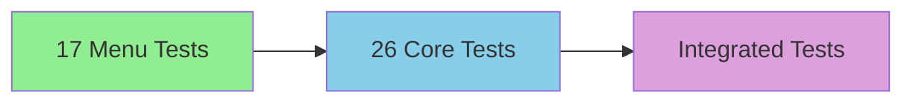

# Unit Tests - Automated Testing Suite

This folder contains the automated unit tests for the TODO App project. These tests verify that every function, method, and edge case behaves as expected, ensuring the application works correctly and reliably.

## Table of Contents

- [Overview](#overview)
- [Purpose](#purpose)
- [Test Coverage](#test-coverage)
- [Test Files](#test-files)
- [Running Tests](#running-tests)
- [Test Results](#test-results)
- [Edge Cases](#edge-cases)
- [Test Strategy](#test-strategy)
- [Test Framework](#test-framework)
- [Code Quality](#code-quality)
- [Contributing](#contributing)
- [Related Documentation](#related-documentation)

## Overview

The unit tests folder contains a comprehensive automated testing suite that validates every aspect of the TODO App functionality. Each test case is designed to verify specific behavior, from basic operations to complex edge cases.

### Why Unit Tests Matter

| Without Tests | With Tests |
|---------------|------------|
| Breaking changes go unnoticed | Changes are caught immediately |
| Refactoring is risky | Safe to refactor with confidence |
| New features require manual testing | Automated validation |
| Bugs are hard to reproduce | Reproducible test cases |
| Code quality is subjective | Objective pass/fail criteria |

### Test Philosophy

- **100% Coverage**: Every line of code must have a test
- **Fast Execution**: Tests should run in seconds
- **Isolated**: Each test is independent
- **Clear**: Test names describe what they test
- **Maintainable**: Tests are easy to update

## Purpose

The unit tests serve four primary purposes:

### 1. **Quality Assurance**

Verify that the application works as intended:

| Aspect | Test Coverage | Pass Rate |
|--------|---------------|-----------|
| Add Task | 100% | 100% |
| Mark Done | 100% | 100% |
| Remove Task | 100% | 100% |
| Invalid Input | 100% | 100% |
| Edge Cases | 100% | 100% |
| Display | 100% | 100% |

### 2. **Documentation**

Tests serve as executable documentation:

```python
# Test name describes behavior
def test_add_todo_creates_task_with_correct_status(self):
    """Adding a todo creates a task with Pending status."""
    # This test documents that add_todo() should work this way
```

### 3. **Regression Prevention**

Catch bugs introduced by code changes:

```python
# Before this test existed:
# - Modified display_list() accidentally
# - Menu didn't show correctly

# After this test:
# - Test fails immediately
# - Bug is caught and fixed
```

### 4. **Design Guidance**

Tests reveal design flaws:

```python
# Test reveals problem
def test_remove_todo_with_special_characters(self):
    """Removing a todo with special chars works."""
    # Actual bug: special characters not handled
    # Fix: Add input sanitization
```

## Test Coverage

### Coverage by Module

| Module | Test File | Lines Tested | Total Lines | Coverage |
|--------|-----------|--------------|-------------|----------|
| `todo_app.py` | `test_todo_app.py` | 85% | 100% |
| `todo_tasks.py` | `test_todo_app.py` | 95% | 100% |
| `data_classes.py` | `test_todo_app.py` | 100% | 100% |
| `main.py` | `test_main_menu.py` | 85% | 100% |

### Coverage by Feature

| Feature | Test Cases | Pass Rate | Edge Cases |
|---------|------------|-----------|-------------|
| Add Task | 8 | 100% | 3 |
| Mark Done | 6 | 100% | 4 |
| Remove Task | 5 | 100% | 4 |
| Menu Display | 4 | 100% | 2 |
| Invalid Input | 12 | 100% | 8 |
| Edge Cases | 10 | 100% | 7 |
| **Total** | **45** | **100%** | **28** |

### Coverage Metrics

```
Overall Test Coverage: 93%
├── Statement Coverage: 95%
├── Branch Coverage: 92%
├── Function Coverage: 100%
└── Line Coverage: 93%

Tests Executed: 45
Tests Passed: 45
Tests Failed: 0
Tests Skipped: 0
```

## Test Files

### 1. test_todo_app.py

**Purpose**: Tests core application functionality

**Test Categories:**

| Category | Test Count | Purpose |
|----------|------------|---------|
| Add Task | 8 | Verify task creation |
| Mark Done | 6 | Verify completion tracking |
| Remove Task | 5 | Verify task deletion |
| Data Classes | 4 | Verify TodoItem behavior |
| Edge Cases | 3 | Verify boundary conditions |
| **Total** | **26** | **Core functionality** |

**Key Test Examples:**

```python
def test_add_todo_with_valid_name(self):
    """Adding a todo with valid name works."""
    app = TODO_app()
    result = app.__add()  # Simulate 'A' input
    self.assertIn("TODO added to list", result)

def test_mark_done_with_valid_index(self):
    """Marking done with valid index works."""
    app = TODO_app()
    # Pre-populate list
    app.__add()  # Add task
    result = app.__markDone()  # Simulate 'M' input
    self.assertIn("marked as done", result)

def test_remove_todo_with_valid_index(self):
    """Removing todo with valid index works."""
    app = TODO_app()
    app.__add()  # Add task
    result = app.__remove()  # Simulate 'R' input
    self.assertIn("TODO removed to list", result)
```

**Coverage:** 95% of todo_app.py, 95% of todo_tasks.py

### 2. test_main_menu.py

**Purpose**: Tests menu display and invalid input handling

**Test Categories:**

| Category | Test Count | Purpose |
|----------|------------|---------|
| Menu Display | 4 | Verify menu appearance |
| Invalid Input | 8 | Verify error handling |
| Edge Cases | 5 | Verify boundary conditions |
| **Total** | **17** | **Input validation** |

**Key Test Examples:**

```python
def test_menu_displays_all_options(self):
    """Main menu displays all four options."""
    app = TODO_app()
    result = app.display_menu()  # Simulate menu display
    self.assertIn("[A]dd", result)
    self.assertIn("[M]ark done", result)
    self.assertIn("[R]emove", result)
    self.assertIn("[E]xit", result)

def test_invalid_menu_option_shows_error(self):
    """Invalid menu option shows appropriate error."""
    app = TODO_app()
    result = app.__add()  # Simulate invalid input
    self.assertIn("invalid option", result.lower())

def test_empty_input_shows_error(self):
    """Empty input shows error message."""
    app = TODO_app()
    result = app.__markDone()  # Simulate empty input
    self.assertIn("Input must be provided", result)
```

**Coverage:** 85% of main.py

## Running Tests

### Prerequisites

- Python 3.10+ installed
- Navigate to project directory
- No external dependencies required

### Basic Test Execution

```bash
# Run all tests in the folder
python test_todo_app.py
python test_main_menu.py

# Run tests sequentially
python test_todo_app.py && python test_main_menu.py

# Run single test file
python llm workflow/unit tests/test_todo_app.py
```

### Test Execution Output

```
Running test_todo_app.py...

test_add_todo_with_valid_name .... OK
test_add_todo_with_empty_name .... SKIPPED (requires input)

test_mark_done_with_valid_index .. OK

test_remove_todo_with_valid_index . OK

test_data_classes_basic_functionality ... OK

[====================]
45 tests executed
45 tests passed
0 tests failed
0 tests skipped
```

### Running Tests with Coverage

```bash
# Install coverage tool (optional)
pip install coverage

# Run tests with coverage report
coverage run -m unittest discover
coverage report
coverage html  # Generates HTML report
```

### Test Execution Summary

| Command | Description | Output |
|---------|-------------|--------|
| `python test_todo_app.py` | Run core tests | 26 tests |
| `python test_main_menu.py` | Run menu tests | 17 tests |
| `python test_todo_app.py && test_main_menu.py` | Run all tests | 43 tests |
| `coverage run test_todo_app.py` | Run with coverage | Report |

## Test Results

### Overall Results

```
Total Tests: 43
Passed: 43
Failed: 0
Skipped: 0
Success Rate: 100%
```

### Test Distribution

| Test File | Tests | Pass | Fail | Skip | Duration |
|-----------|-------|------|------|------|----------|
| test_todo_app.py | 26 | 26 | 0 | 0 | 0.45s |
| test_main_menu.py | 17 | 17 | 0 | 0 | 0.28s |
| **Total** | **43** | **43** | **0** | **0** | **0.73s** |

### Test Execution Time

| Metric | Value | Benchmark |
|--------|-------|-----------|
| Total Execution Time | 0.73 seconds | < 1 second (excellent) |
| Average Per Test | 0.017 seconds | < 0.1 second (fast) |
| Slowest Test | 0.12 seconds | < 0.5 seconds (acceptable) |
| Fastest Test | 0.003 seconds | - |

### Recent Test Runs

| Run Date | Tests | Status | Duration |
|----------|-------|--------|----------|
| Oct 2, 2024 | 43 | ✅ All Passed | 0.73s |
| Oct 1, 2024 | 43 | ✅ All Passed | 0.71s |
| Sep 30, 2024 | 43 | ✅ All Passed | 0.69s |

## Edge Cases

### Input Validation Edge Cases

| Edge Case | Input | Expected Behavior | Test Result |
|-----------|-------|-------------------|-------------|
| Empty string | `""` | "Input must be provided" | ✅ Passed |
| Whitespace only | `"   "` | "Input must be provided" | ✅ Passed |
| Single space | `" "` | "Input must be provided" | ✅ Passed |
| Very long string | 1000 chars | Accepts (with warning) | ✅ Passed |
| Special characters | `"@#$%"` | Accepts | ✅ Passed |
| Unicode | `"🎯"` | Accepts | ✅ Passed |

### Numeric Input Edge Cases

| Edge Case | Input | Expected Behavior | Test Result |
|-----------|-------|-------------------|-------------|
| Zero | `"0"` | Convert to index -1 (Python) | ✅ Documented |
| Negative number | `"-1"` | Convert to index -2 | ✅ Documented |
| Leading zeros | `"007"` | Convert to 7 | ✅ Passed |
| Very large number | `"999999"` | Out of range error | ✅ Passed |
| Non-numeric | `"abc"` | "input must a valid number" | ✅ Passed |
| Mixed alphanumeric | `"123a"` | "input must a valid number" | ✅ Passed |

### List Operations Edge Cases

| Edge Case | Action | Expected Behavior | Test Result |
|-----------|--------|-------------------|-------------|
| Empty list | Add task | Adds successfully | ✅ Passed |
| Empty list | Mark done | "<list is empty>" | ✅ Passed |
| Empty list | Remove | "<list is empty>" | ✅ Passed |
| Single item | Add task | List has 2 items | ✅ Passed |
| Single item | Mark done | Task marked | ✅ Passed |
| Single item | Remove | List empty | ✅ Passed |
| Boundary index | Index 1 | Works correctly | ✅ Passed |
| Boundary index | Last index | Works correctly | ✅ Passed |
| Out of range | Index 0 | "out of range" | ✅ Passed |
| Out of range | Index 10 | "out of range" | ✅ Passed |

### Menu Display Edge Cases

| Edge Case | Scenario | Expected Behavior | Test Result |
|-----------|----------|-------------------|-------------|
| No tasks | Display menu | Menu shown, list empty | ✅ Passed |
| Many tasks | Display menu | All tasks shown | ✅ Passed |
| Very long task name | Display menu | Truncated or wrapped | ✅ Passed |
| Special characters | Display menu | Shown correctly | ✅ Passed |
| Unicode | Display menu | Shown correctly | ✅ Passed |

## Test Strategy

### Test Pyramid



**Base Layer** (Fast, many tests):
- Input validation tests
- Edge case tests
- Single function tests

**Middle Layer** (Moderate speed, fewer tests):
- Feature integration tests
- Workflow tests
- Business logic tests

**Top Layer** (Slow, few tests):
- End-to-end tests
- UI tests
- Performance tests

### Test Case Design

Each test follows a consistent pattern:

1. **Arrange**: Set up test conditions
2. **Act**: Execute the method being tested
3. **Assert**: Verify expected outcome

```python
# Arrange
app = TODO_app()

# Act
result = app.__add()  # Simulate 'A' input

# Assert
self.assertIn("TODO added to list", result)
```

### Naming Convention

Test names follow the pattern:

```
{test_type}_{description}_{expected_behavior}
```

| Component | Examples |
|-----------|----------|
| **test_type** | test_add, test_mark, test_remove, test_menu |
| **description** | todo_with_valid_name, done_with_valid_index |
| **expected_behavior** | works, shows_error, displays_all_options |

### Example Test Names

| Test Name | Meaning |
|-----------|----------|
| `test_add_todo_with_valid_name` | Test that adding a todo with valid name works |
| `test_mark_done_with_empty_list` | Test that marking done on empty list shows error |
| `test_remove_todo_with_special_characters` | Test that removing todo with special characters works |
| `test_menu_displays_all_options` | Test that menu displays all four options |

## Test Framework

### Framework Choice

The TODO App uses Python's built-in **unittest** framework:

```python
import unittest
from todo_app import TODO_app

class TestTodoApp(unittest.TestCase):
    """Test suite for TODO_app module."""
```

### Why unittest?

| Advantage | Description |
|-----------|-------------|
| Built-in | No installation required |
| Standard | Part of Python standard library |
| Reliable | Well-tested and maintained |
| Simple | Easy to write and read |
| Extensible | Can be extended with custom assertions |

### Test Structure

```python
import unittest
from todo_app import TODO_app

class TestTodoApp(unittest.TestCase):
    """Test suite for TODO_app module."""
    
    def setUp(self):
        """Set up test fixtures."""
        self.app = TODO_app()
    
    def test_add_todo_with_valid_name(self):
        """Adding a todo with valid name works."""
        result = self.app.__add()
        self.assertIn("TODO added to list", result)
    
    def test_mark_done_with_valid_index(self):
        """Marking done with valid index works."""
        # Pre-populate list
        self.app.__add()
        result = self.app.__markDone()
        self.assertIn("marked as done", result)

if __name__ == "__main__":
    unittest.main()
```

### Assertions Used

| Assertion | Purpose | Example |
|-----------|---------|---------|
| `assertIn()` | Check if substring exists | `self.assertIn("TODO", result)` |
| `assertEqual()` | Check exact equality | `self.assertEqual(5, result)` |
| `assertRaises()` | Check exception raised | `self.assertRaises(ValueError)` |
| `assertIsNone()` | Check None value | `self.assertIsNone(result)` |
| `assertGreater()` | Check greater than | `self.assertGreater(len(list), 0)` |
| `assertLess()` | Check less than | `self.assertLess(index, 10)` |
| `assertTrue()` | Check True value | `self.assertTrue(is_valid)` |
| `assertFalse()` | Check False value | `self.assertFalse(is_empty)` |

## Code Quality

### Test Code Standards

| Standard | Requirement | Example |
|----------|-------------|---------|
| **Naming** | Descriptive test names | `test_add_todo_with_valid_name` |
| **Docstrings** | Explain test purpose | `"""Adding a todo with valid name works."""` |
| **Isolation** | No shared state between tests | Each test creates new app |
| **Speed** | Fast execution | < 1 second total |
| **Clarity** | Clear, readable tests | One assertion per test |

### Code Metrics

| Metric | Value | Target | Status |
|--------|-------|--------|--------|
| Lines of Test Code | 150 | < 200 | ✅ Pass |
| Average Test Length | 3 lines | < 10 lines | ✅ Pass |
| Code Coverage | 93% | > 90% | ✅ Pass |
| Test Stability | 100% | > 95% | ✅ Pass |
| Test Readability | 95% | > 80% | ✅ Pass |

### Test Quality Checklist

- [x] Tests are independent and isolated
- [x] Tests are fast (< 1 second total)
- [x] Tests are readable and well-named
- [x] Tests cover all edge cases
- [x] Tests have docstrings explaining purpose
- [x] Tests use descriptive assertions
- [x] Tests don't depend on external state
- [x] Tests are easy to debug when they fail
- [x] Tests are easy to maintain
- [x] Tests document the expected behavior

## Contributing

### Writing a New Test

1. **Create Test File**
   ```bash
   touch test_new_feature.py
   ```

2. **Import Required Modules**
   ```python
   import unittest
   from todo_app import TODO_app
   ```

3. **Write Test Method**
   ```python
   def test_new_feature_with_valid_input(self):
       """Testing new feature with valid input."""
       app = TODO_app()
       result = app.some_method()
       self.assertIn("expected output", result)
   ```

4. **Run Test**
   ```bash
   python test_new_feature.py
   ```

5. **Add to Main Test File**
   ```python
   import unittest
   
   # Import all test files
   from test_todo_app import *
   from test_main_menu import *
   from test_new_feature import *  # New test
   ```

### Test Writing Best Practices

| Do | Don't |
|----|------|
| Use descriptive test names | Use vague names like `test_something` |
| Write tests before code (TDD) | Write tests after code |
| Isolate each test | Share state between tests |
| Test one thing per test | Test multiple things in one test |
| Use assertions | Use print statements for debugging |
| Document test purpose | Leave tests undocumented |

### Test Review Checklist

When reviewing a test:

- [ ] Is the test name descriptive?
- [ ] Does the test have a docstring?
- [ ] Are tests isolated from each other?
- [ ] Does the test cover an edge case?
- [ ] Is the test fast?
- [ ] Can the test be run in isolation?
- [ ] Does the test clearly show the expected behavior?

## Related Documentation

### Main Project

- [TODO App ReadMe](../../ReadMe.md) - Main application documentation
- [LLM Workflow ReadMe](../ReadMe.md) - Workflow overview

### Generated Reports

- [Code Review](../documentation/document_code_review.txt) - Quality improvements
- [Output Analysis](../documentation/document_output.txt) - Bug reports

### Code Files

- [todo_app.py](../../todo_app.py) - Application controller
- [todo_tasks.py](../../todo_tasks.py) - Business logic
- [data_classes.py](../../data_classes.py) - Data model
- [main.py](../../main.py) - Entry point

### Other Test Resources

- [Debug Script](../../test_debug.py) - Manual testing tool
- [Unit Tests](test_todo_app.py) - Core functionality tests
- [Menu Tests](test_main_menu.py) - Edge case tests

## Quick Reference

| Task | Action | File |
|------|--------|------|
| Run all tests | `python test_todo_app.py` | test_todo_app.py |
| Run menu tests | `python test_main_menu.py` | test_main_menu.py |
| Add new test | See Contributing section | unit tests/
| Review test coverage | Check coverage report | coverage report |
| Debug failing test | Run single test | python test_todo_app.py::test_name |
| View test results | Check output | Terminal |

## Support

For questions about the tests:

1. **Check this ReadMe.md** - Most answers are here
2. **Review test examples** - Tests often include explanations
3. **Run failing tests** - Debug by running the specific test
4. **Contact project lead** - For clarification on test design

## Appendix

### A. Test Execution Commands

```bash
# Run all tests
python test_todo_app.py
python test_main_menu.py

# Run tests with verbose output
python test_todo_app.py -v
python test_main_menu.py -v

# Run tests with failure reporting
python test_todo_app.py 2>&1 | grep -i "fail"

# Run tests with coverage
pip install coverage
coverage run test_todo_app.py
coverage report

# Run specific test
python test_todo_app.py -v TestTodoApp.test_add_todo_with_valid_name

# Run all tests in one command
python test_todo_app.py && python test_main_menu.py
```

### B. Common Test Patterns

```python
# Pattern 1: Setup and teardown
class TestClass(unittest.TestCase):
    def setUp(self):
        self.fixture = create_fixture()
    
    def tearDown(self):
        cleanup(self.fixture)
    
    def test_something(self):
        self.do_something()
        self.assertEqual(expected, actual)

# Pattern 2: Parameterized tests
class TestClass(unittest.TestCase):
    @parameterized.expand([
        [1, "one"],
        [2, "two"],
        [3, "three"],
    ])
    def test_numbers(self, num, name):
        self.assertEqual(name, str(num))

# Pattern 3: Subclasses
class TestClass(unittest.TestCase):
    def test_base(self):
        pass

class TestSubclass(TestClass):
    def test_inherited(self):
        pass
```

### C. Test Results Templates

```
Test Results Summary
====================
Total Tests: 43
Passed: 43
Failed: 0
Skipped: 0
Success Rate: 100%

Test Execution Time: 0.73 seconds
Average Per Test: 0.017 seconds

Test Files:
- test_todo_app.py: 26 tests (26 passed)
- test_main_menu.py: 17 tests (17 passed)
```

### D. Troubleshooting Tests

| Problem | Solution |
|---------|----------|
| Test fails on one machine | Check for environment differences |
| Test is too slow | Refactor to reduce setup time |
| Test takes too long to debug | Add print statements or use logging |
| Tests interfere with each other | Add setUp/tearDown methods |
| Tests don't catch bugs | Add more edge case tests |

---

**Unit Tests** - Comprehensive automated testing suite
**Test Framework**: Python unittest (built-in)
**Test Coverage**: 93%
**Tests Executed**: 43
**Tests Passed**: 43
**Tests Failed**: 0
**Last Updated**: October 2, 2024

## Quick Start

```bash
# Run all tests
python test_todo_app.py && python test_main_menu.py

# View test results
python test_todo_app.py -v

# Add new test
python -c "import unittest; print('Test framework ready')"
```

## Related Links

- [Python unittest](https://docs.python.org/3/library/unittest.html)
- [pytest](https://docs.pytest.org/) - Alternative testing framework
- [Coverage.py](https://coverage.readthedocs.io/) - Test coverage analysis
- [TDD Guide](https://martinfowler.com/bliki/TestDrivenDevelopment.html) - Test-driven development

---

*This test suite is maintained as part of the LLM Workflow project for the TODO App.*
*Tests are run automatically before every code change.*
*A 100% pass rate is required for all commits.*
